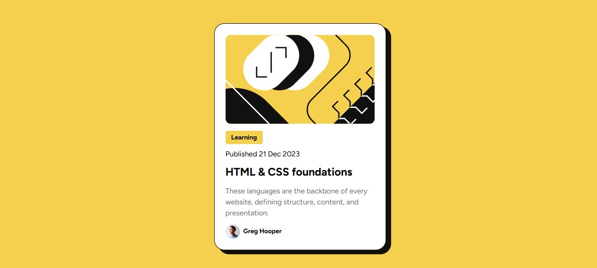

# Frontend Mentor - Blog preview card solution

## Table of contents

- [Overview](#overview)
  - [The challenge](#the-challenge)
  - [Screenshot](#screenshot)
  - [Links](#links)
- [My process](#my-process)
  - [Built with](#built-with)
  - [What I learned](#what-i-learned)
  - [Continued development](#continued-development)
  - [Useful resources](#useful-resources)
  - [AI Collaboration](#ai-collaboration)
- [Author](#author)
- [Acknowledgments](#acknowledgments)

### Screenshot




### Links

- Solution URL: [My repository](https://github.com/David-VB03/Blog_Preview_Card)
- Live Site URL: [My URL](https://your-live-site-url.com)

## My process

### Built with

- Semantic HTML5 markup
- Flexbox css
- CSS Architecture
- Accesibility 
- CSS Variables
- Indentation Correct Use


### What I learned

I learned how to organize my mind before I'll do my solution to this callenge , I draw in a piece bond of paper a prototype of how should I build it and what properties or methods use , For example I used to use flexbox property to align main card and then I'll do the same with the elements into of the card.
Also for save time in my solution , I created css variables for style elements like color , font-size and opacity.
I understood how it worked in a webpage according to the initial position 
For last , I'll leave below some code that I helped me a lot .


```css
main{
    display: flex;
    justify-content: center;
    align-items: center;
   min-height: 100vh;
}
section{
     
    width: 80%;
    max-width: 375px;
    background-color: var(--white-color);
    box-shadow: 10px 8px 0px 1px rgba(0,0,0,0.92);
   padding: 1.5rem;
   border-radius: 1.4rem;
   border:1px black solid;
   display: flex;
   flex-direction: column;
   align-items: flex-start;
   gap: var(--spacing-150);
   margin: var(--spacing-100) 0;
}
```

### Continued development

After I solve this challenge I'll continue with other project in Frontend mentor but This time I try doing in shorter time and folowing best practices in css and I should everyone read a bit of documentation before start a project.

## Author

- Website - [David Vb] Very soon
- Linkedn - [@DavidVB](https://www.linkedin.com/in/rey-david-velasquez-baylon-340943247/)


## Acknowledgments

You never give UP in your GOALS !!! Good luck !!